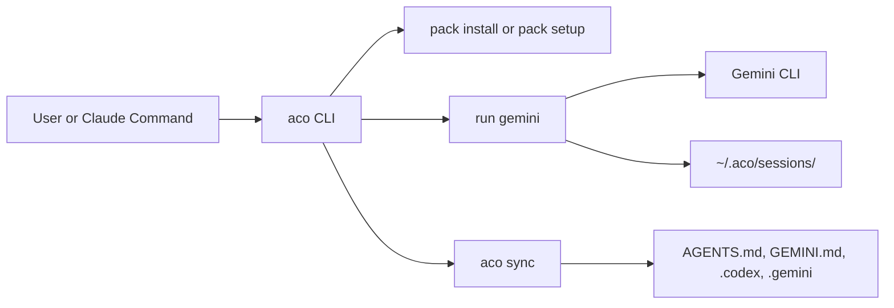

# ai-cli-orch-wrapper

`@pureliture/ai-cli-orch-wrapper`는 Claude Code command pack 설치와 Gemini CLI 실행을
담당하는 `aco` CLI 패키지입니다.

## What It Does

- Claude Code slash command/prompt 템플릿 설치 (`aco pack install`, `aco pack setup`)
- Gemini CLI 설치/인증 점검 (`aco provider setup gemini`)
- Gemini 실행 + 세션 로그 관리 (`aco run`, `aco status`, `aco result`, `aco cancel`)
- Claude 설정을 Codex/Gemini 타깃으로 동기화 (`aco sync`)

## Requirements

- Node.js `>=18` (package engines 기준)
- Gemini CLI (`npm install -g @google/gemini-cli`)
- Gemini 인증 (`gemini` 1회 실행 후 로그인)
- `aco sync` 사용 시: Git 저장소 루트(또는 `CLAUDE.md`가 있는 루트)에서 실행

## Quick Start

### 1) 설치 없이 바로 사용 (npx)

```bash
npx @pureliture/ai-cli-orch-wrapper pack setup
npx @pureliture/ai-cli-orch-wrapper provider setup gemini
npx @pureliture/ai-cli-orch-wrapper run gemini review --input "review this change"
```

`npx`는 `aco`를 PATH에 고정 설치하지 않으므로, 이후 명령도 같은 방식으로 실행합니다.

### 2) `aco` 명령을 PATH에서 직접 사용

```bash
npm install -g @pureliture/ai-cli-orch-wrapper
aco --version
aco pack setup
aco provider setup gemini
```

### 3) 저장소 checkout에서 직접 실행

```bash
npm install
npm run build
node packages/wrapper/dist/cli.js pack setup
node packages/wrapper/dist/cli.js provider setup gemini
node packages/wrapper/dist/cli.js sync --check
```

## Command Reference

| Command | Purpose |
| --- | --- |
| `aco pack install [--global] [--force] [--binary-name <name>]` | command/prompt 템플릿 설치 |
| `aco pack setup [--global] [--force]` | pack 설치 + provider 상태 점검 + context sync 실행 |
| `aco pack status [--global]` | 설치된 slash command와 provider 상태 점검 |
| `aco pack uninstall [--global]` | install manifest 기반으로 pack 제거 |
| `aco provider setup gemini` | Gemini CLI 설치/인증 상태 점검 |
| `aco run gemini <command> [--input <text>] [--permission-profile ...]` | Gemini 실행 |
| `aco result [--session <id>]` | 세션 출력 로그 확인 |
| `aco status [--session <id>]` | 세션 상태 확인 |
| `aco cancel [--session <id>]` | 실행 중 세션 취소 |
| `aco sync [--check] [--dry-run] [--force]` | Claude 설정을 Codex/Gemini 타깃으로 동기화 |

지원 provider는 현재 `gemini` 하나입니다.

## Install Targets

| Surface | Default Target | Global Option |
| --- | --- | --- |
| command templates | `<cwd>/.claude/commands/` | `~/.claude/commands/` (`--global`) |
| prompt templates | `<cwd>/.claude/aco/prompts/` | `~/.claude/aco/prompts/` (`--global`) |
| pack manifest | `<cwd>/.claude/aco/aco-manifest.json` | `~/.claude/aco/aco-manifest.json` |
| session logs | `~/.aco/sessions/<uuid>/` | same |
| sync manifest | `<repo>/.aco/sync-manifest.json` | same |

## Runtime Flow



## Troubleshooting

| Symptom | Cause | Fix |
| --- | --- | --- |
| `aco: command not found` | global 설치 안 됨 | `npm install -g @pureliture/ai-cli-orch-wrapper` 또는 `npx ...` 사용 |
| `Unknown provider: ...` | 현재 `gemini`만 지원 | `aco provider setup gemini`로 실행 |
| `gemini: not installed` | Gemini CLI 미설치 | `npm install -g @google/gemini-cli` |
| `gemini: installed ✓ auth ✗` | Gemini 인증 미완료 | `gemini` 실행 후 로그인 |
| `aco sync: could not find repository root` | 저장소 루트 밖에서 sync 실행 | Git 루트 또는 `CLAUDE.md` 루트에서 재실행 |
| sync conflict/stale 경고 | manifest 관리 파일 수동 수정 | `aco sync --check`로 확인 후 필요 시 `aco sync --force` |

## Repository Layout

```text
packages/
  wrapper/      # public npm package: @pureliture/ai-cli-orch-wrapper
  installer/    # internal transitional workspace
templates/
  commands/     # copied to .claude/commands/
  prompts/      # copied to .claude/aco/prompts/
cmd/aco/        # Go runtime (delegate/run path)
internal/       # Go provider and runner internals
docs/           # architecture, guides, reference
openspec/       # spec and change artifacts
```

## Documentation

- [docs/README.md](docs/README.md): 문서 인덱스
- [docs/architecture.md](docs/architecture.md): Node wrapper/Go runtime 구조
- [docs/guides/runbook.md](docs/guides/runbook.md): 운영/배포 체크리스트
- [docs/reference/context-sync.md](docs/reference/context-sync.md): `aco sync` 변환 규칙

## Development

```bash
npm install
npm run build
npm test
npm run typecheck
```
