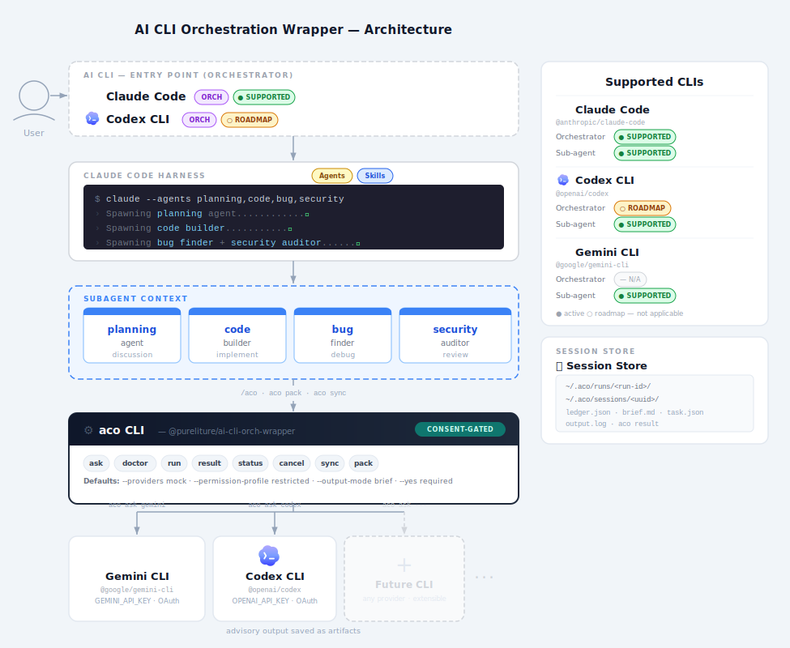
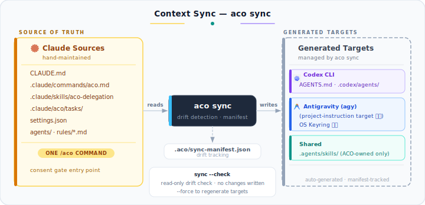
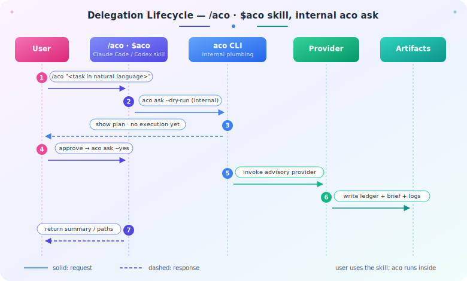
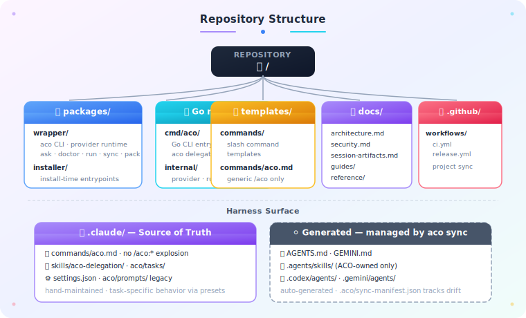

<!-- ──────────────── HERO BANNER ──────────────── -->
<div align="center">


<br/>

<!-- Project badges -->
<a href="https://www.npmjs.com/package/@pureliture/ai-cli-orch-wrapper">
  
</a>


<br/><br/>

<!-- Tagline -->
<h3>
  Claude Code의 <code>/aco</code> 및 Codex의 <code>$aco</code> 스킬을 통해<br/>
  외부 AI CLI에 advisory 작업을 안전하게 위임하는 <b>consent-gated AI delegation wrapper</b>입니다.
</h3>

<br/>

<!-- Tech stack -->
<p>
  
  
  
  &nbsp;<b>Claude</b>
  &nbsp;&nbsp;&nbsp;<b>Antigravity</b>
  &nbsp;&nbsp;&nbsp;<b>Codex</b>
</p>

<br/>

<!-- Quick navigation -->
<p>
  <a href="#-아키텍처-개요"></a>
  <a href="#-사용자-가이드"></a>
  <a href="#-사용-시나리오"></a>
  <a href="#-저장소-구조"></a>
  <a href="#%EF%B8%8F-하네스-구성"></a>
</p>

</div>

<br/>

<!-- ────────────── SECTION DIVIDER ────────────── -->


<br/>

## 🏛️ 아키텍처 개요

> Claude Code `/aco` · Codex `$aco` 스킬을 사용하여 외부 AI CLI를 **하나의 반복 가능한 개발 워크플로우**로 묶고, 동의 하에 advisory 작업을 위임하는 것이 목표입니다.

용어 기준: provider invocation, run/session artifacts, briefs, advisory output은
[Ubiquitous Language](docs/reference/ubiquitous-language.md)에 정의되어 있습니다.

<p align="center">
  
</p>

<br/>

### 🎨 핵심 설계 포인트

<table>
<tr>
<td width="50%" valign="top">

#### 🟣 Harness / Generated 분리

`.claude/`는 **사람이 관리하는 기준 자산**.<br/>
Codex 구조적 표면(`.codex/agents/`·hooks)은 생성 산출물로 관리되고, `AGENTS.md`는 사람이 직접 유지보수하는 peer 문서입니다. 운영 중 수동 수정과 자동 생성의 경계가 분명합니다.

</td>
<td width="50%" valign="top">

#### 🔵 Provider Abstraction

동일한 `aco` 진입점에서<br/>
**Antigravity · Codex별 실행 차이를 흡수**합니다.<br/>
새 provider 추가는 `IProvider` 구현 + registry 등록으로 끝납니다.

</td>
</tr>
<tr>
<td width="50%" valign="top">

#### 🟢 Session-Aware Operations

스킬 내부에서 라이프사이클을 관리하며,<br/>
**위임 세션의 상태 확인 및 취소를 지원**합니다.<br/>
모든 실행은 `~/.aco/sessions/`에 보존됩니다.

</td>
<td width="50%" valign="top">

#### 🟠 Node + Go 이중 실행

**Node wrapper**는 공개 npm UX를,<br/>
**Go runtime**은 blocking provider 실행 실험을 담당합니다.<br/>
책임 경계가 문서·구현 양쪽에서 분리됩니다.

</td>
</tr>
</table>

<br/>

### 🔄 Context 동기화 흐름

<p align="center">
  
</p>

> 💡 `aco sync`는 **default-deny** 정책으로 동작합니다. `.claude/skills/` 전체를 복사하지 않고
> 명시적으로 허용된 ACO-owned 공유 skill만 `.agents/skills/`에 동기화합니다.
> 자세한 변환 규칙은 [docs/reference/context-sync.md](docs/reference/context-sync.md)를 참고합니다.

<br/>

<!-- ────────────── SECTION DIVIDER ────────────── -->


<br/>

## 📖 사용자 가이드

### ⚡ 요구사항

<table>
<thead>
<tr>
<th>의존성</th><th>필수 여부</th><th>용도</th><th>설치</th>
</tr>
</thead>
<tbody>
<tr>
<td></td>
<td>✅ 필수</td>
<td>npm workspace 및 공개 npm CLI 실행</td>
<td><code>≥ 18.x</code></td>
</tr>
<tr>
<td>&nbsp;<b>Claude Code</b></td>
<td>✅ 필수</td>
<td>repo-local command pack 기준 실행</td>
<td>Anthropic 공식 CLI</td>
</tr>
<tr>
<td>&nbsp;<b>Antigravity CLI</b></td>
<td>🟡 Provider별</td>
<td>Antigravity provider 사용 시</td>
<td><code>curl -fsSL https://antigravity.google/cli/install.sh | bash</code></td>
</tr>
<tr>
<td>&nbsp;<b>Codex CLI</b></td>
<td>🟡 Provider별</td>
<td>Codex provider 사용 시</td>
<td><code>npm i -g @openai/codex</code></td>
</tr>
</tbody>
</table>

<br/>

### 🚀 설치

<details open>
<summary><b>방법 1 — published npm package 사용</b></summary>

```bash
npx @pureliture/ai-cli-orch-wrapper pack setup
npx @pureliture/ai-cli-orch-wrapper provider setup antigravity
npx @pureliture/ai-cli-orch-wrapper provider setup codex
```

</details>

<details>
<summary><b>방법 2 — local tarball로 설치 검증</b></summary>

```bash
npm install
npm run build --workspace=packages/wrapper
npm pack --workspace=packages/wrapper --pack-destination /tmp/aco-pack
npm install -g /tmp/aco-pack/pureliture-ai-cli-orch-wrapper-<version>.tgz
aco pack setup
```

</details>

<details>
<summary><b>방법 3 — 저장소 checkout에서 직접 실행 (최신 source)</b></summary>

```bash
npm install
npm run build --workspace=packages/wrapper
node packages/wrapper/dist/cli.js pack setup
node packages/wrapper/dist/cli.js provider setup antigravity
node packages/wrapper/dist/cli.js sync --check
```

</details>

`aco pack setup`은 `.claude/commands`, `.claude/aco/prompts`, `.claude/aco/tasks`를 설치하여 Claude Code와 Codex에 `/aco` 및 `$aco` 스킬을 활성화합니다.
`--global`로 설치하면 큐레이션된 skill(`aco-delegation` 등)을 `~/.claude/skills/`에도 배포하므로 repo clone 없이 `npx … pack install --global`만으로 skill까지 설치·버전업할 수 있습니다.
패키지에 포함된 task preset은 `review`, `spec-critique`, `plan-critique`, `tdd`, `code-simplify`, `default`이며, 실제 외부 AI 호출 없이 작동 계획만 확인하는 `--dry-run` 실행을 지원합니다.

설치 후 스킬 실행 확인 — `/aco`는 외부 AI를 부르기 전에 실행 계획(dry-run)을 먼저 보여주고, 동의해야 실제로 위임합니다 (Claude Code):
```markdown
> /aco 이 변경을 antigravity로 리뷰해줘
```

또는 Codex 환경에서:
```markdown
> $aco 이 변경을 codex로 리뷰해줘
```

<details>
<summary>⚙️ 내부 Plumbing 도구 상태 확인</summary>

하부 런타임 CLI 버전 확인:
```bash
aco --version
# 또는
npx @pureliture/ai-cli-orch-wrapper --version
```
</details>

<br/>

### 🔧 Provider 설정

<table>
<thead>
<tr>
<th align="center">Provider</th>
<th>외부 CLI 설치</th>
<th>인증 소스</th>
</tr>
</thead>
<tbody>
<tr>
<td align="center"><br/><b>Antigravity</b></td>
<td><code>curl -fsSL https://antigravity.google/cli/install.sh | bash</code></td>
<td>OS Keyring (no API key env required)</td>
</tr>
<tr>
<td align="center"><br/><b>Codex</b></td>
<td><code>npm install -g @openai/codex</code></td>
<td><code>OPENAI_API_KEY</code> · <code>~/.codex/auth.json</code></td>
</tr>
</tbody>
</table>

```bash
# provider CLI와 local credential readiness 확인
npx @pureliture/ai-cli-orch-wrapper provider setup antigravity
npx @pureliture/ai-cli-orch-wrapper provider setup codex
```

> ⚠️ **Headless / CI 환경 주의사항**
>
> - Antigravity: OS Keyring 기반 인증. API key 환경변수 불필요. `-m`/`--cwd` 플래그 미지원
> - Codex: `OPENAI_API_KEY` 또는 OAuth. 토큰 만료 시 `codex login` 재실행

<br/>

### 🧩 스킬 인터페이스 (Claude Code /aco · Codex $aco)

사용자의 1차 진입점은 단 하나의 스킬입니다. 자연어로 작업을 적으면 `/aco`가 컨텍스트를 읽어 어떤 provider로 무엇을 위임할지 정하고, **실행 계획을 먼저 보여준 뒤** 동의하면 실행해 결과 요약을 돌려줍니다.

| 스킬 | 용도 | 사용법 예시 |
|---|---|---|
| `/aco <자연어 작업>` | 동의 기반 외부 AI 위임 — 계획 제시 → 동의 → 실행 → 요약 반환 | `/aco antigravity로 이 PR 리뷰해줘` |
| `$aco <자연어 작업>` | 위와 동일 (Codex 세션) | `$aco 이 설계안 비평해줘` |

> 세션 상태 조회·결과 열람·취소(`aco status`/`result`/`cancel`)와 로컬 프롬프트 빌더(`aco delegate`)는 사용자가 직접 칠 일이 드문 **하부 CLI**입니다 — 아래 Plumbing Reference 참고.

---

<details>
<summary>🛠️ 하부 런타임 CLI 명령 참조 (Plumbing Reference)</summary>

사용자가 직접 터미널에 입력하는 대신, 스킬 내부에서 작동하는 하부 CLI 명령어셋입니다.

<table>
<thead>
<tr>
<th align="center">그룹</th>
<th>명령</th>
<th>목적</th>
</tr>
</thead>
<tbody>
<tr>
<td align="center"></td>
<td><code>aco pack install</code><br/><code>aco pack setup</code><br/><code>aco pack status</code></td>
<td>Claude command pack 설치·설정·상태 확인</td>
</tr>
<tr>
<td align="center"></td>
<td><code>aco provider setup &lt;name&gt;</code></td>
<td>provider CLI · credential readiness 확인</td>
</tr>
<tr>
<td align="center"></td>
<td><code>aco ask --task "..." --dry-run</code><br/><code>aco ask --providers mock --task "..." --yes</code></td>
<td>동의 기반 외부 AI 위임 · bounded brief 반환</td>
</tr>
<tr>
<td align="center"></td>
<td><code>aco sync --check</code><br/><code>aco sync --force</code></td>
<td>Codex/Antigravity target drift 확인 및 갱신</td>
</tr>
<tr>
<td align="center"></td>
<td><code>aco run antigravity review</code><br/><code>aco run codex review</code></td>
<td>provider command 실행 · session 생성</td>
</tr>
<tr>
<td align="center"></td>
<td><code>aco doctor</code></td>
<td>local-only 환경 · harness · provider readiness 진단</td>
</tr>
<tr>
<td align="center"></td>
<td><code>aco status</code><br/><code>aco result</code><br/><code>aco cancel --session &lt;id&gt;</code></td>
<td>session 상태 · 결과 · 취소</td>
</tr>
</tbody>
</table>

`aco doctor`는 local-only 진단 명령입니다. Node/aco version, git repo, `.claude` harness, generic
`/aco` command, `aco-delegation` skill, provider availability, local credential readiness heuristic,
sync drift 상태를 확인하지만 real provider execution이나 remote auth verification은 수행하지 않습니다.
</details>

### 🧭 Consent-Gated Delegation

`aco ask`는 Claude Code 세션 안에서 외부 AI CLI에 advisory 작업을 맡기기 위한 high-level
wrapper입니다. provider 실행은 명시적 동의 없이는 시작되지 않습니다.

<p align="center">
  
</p>

> 💡 `--dry-run`은 실행 계획만 표시하고 provider를 호출하지 않습니다. 실제 위임은 `--yes`로
> 명시 동의했을 때만 시작되며, 그 시점에 session이 생성되고 ledger·brief·output이 기록됩니다.

```bash
# 실행 계획만 확인하고 provider는 호출하지 않음
aco ask --providers mock --task "review this demo input" --input "demo" --dry-run

# 다중 파일(glob)과 단일 파일 입력 (1MB 제한, credential 감지 시 --allow-sensitive 필요)
aco ask --providers mock --task "review files" --paths "src/**/*.ts" --input-file ".env.example" --allow-sensitive --yes

# 명시 동의 후 실행. full output은 session artifact에 저장되고 stdout에는 brief만 출력
aco ask --providers mock --task "review this demo input" --input "demo" --yes --output-mode brief

# 저장된 full output 조회
aco result

# local harness/provider readiness 점검. 네트워크나 real provider 호출 없음
aco doctor
```

기본값은 `--permission-profile restricted`와 `--output-mode brief`입니다. `--output-mode full`은
사용자가 현재 Claude Code 세션에 provider raw output을 직접 넣고 싶을 때만 명시적으로 사용합니다.
`brief`는 provider별 600자 bounded summary만 stdout에 포함하고, full output은 artifact에 저장합니다.
`mock` provider는 인증 없는 deterministic demo 전용이며, 실제 AI 품질을 의미하지 않습니다.

### 위임(/aco) vs 로컬 프롬프트 빌더(aco delegate)

| 표면 | 용도 | 작동 방식 |
|--------|------|------|
| `/aco <자연어>` · `$aco <자연어>` | 외부 AI provider(Antigravity, Codex)에 advisory 위임 | 스킬이 계획 제시 → 동의 시 내부적으로 `aco ask` 실행 |
| `aco delegate <agent-id>` (하부 CLI) | 명명된 agent spec과 seed로 로컬 프롬프트 구성 | 외부 호출 없음, stdout으로 프롬프트 출력 |

`/aco`는 동의 게이트를 거쳐 외부 provider를 실제로 호출하고 결과를 로컬 아티팩트에 보존합니다.
`aco delegate`는 외부 호출 없이 `.claude/agents/<agent-id>.md`의 spec과 seed를 결합해 stdout에 출력하는 하부 CLI이며, 스킬이나 스크립트 내부에서 프롬프트 재료로 씁니다.

<details>
<summary>로컬 프롬프트 빌더(aco delegate) CLI 예시</summary>

```bash
# 프로젝트의 .claude/agents/<agent-id>.md spec과 seed를 결합한 프롬프트를 stdout에 출력
aco delegate <agent-id> --input "$(git diff HEAD)"

# 입력 내용을 파일에서 로드하여 프롬프트 빌드
aco delegate <agent-id> --input-file context.txt
```
</details>

<details>
<summary>⚙️ 내부 Plumbing 실행 및 대시보드 예시</summary>

`aco run`이 인터랙티브 TTY(stderr)에서 출력하는 세션 대시보드 예시입니다. `aco ask`를
Claude `/aco`·Codex `$aco`처럼 비-TTY host로 위임할 때는 `--runtime-banner`로 동일한
정보를 stdout에 ANSI-free로 출력해 host가 사용자에게 표시합니다:

```text
🛰️  aco Runtime Session

✨ Active
  Provider:   antigravity
  Command:    review
  Session ID: f3f2d9...b1
  Auth:       ready (keyring)
  Branch:     main

🧩 Exposed
  Providers:  antigravity
  Agents:     reviewer, planner
  Hooks:      PostToolUse
  Skills:     review-skill
```
</details>

<br/>

<!-- ────────────── SECTION DIVIDER ────────────── -->


<br/>

## 🎯 사용 시나리오

<table>
<thead>
<tr>
<th align="center" width="33%">

</th>
<th align="center" width="33%">

</th>
<th align="center" width="33%">

</th>
</tr>
</thead>
<tbody>
<tr>
<td valign="top">

**🎬 상황**
AI delegation workflow를 처음 도입하는 저장소

**📋 단계**

```diff
+ ① command pack 설치
  npx @pureliture/ai-cli-orch-wrapper pack setup

+ ② provider 활성화
  npx @pureliture/ai-cli-orch-wrapper provider setup antigravity

+ ③ 동기화 검증
  npx @pureliture/ai-cli-orch-wrapper sync --check

+ ④ 스킬 첫 실행 — 계획 확인 후 동의
  > /aco antigravity로 이 저장소를 리뷰해줘

+ ⑤ 결과는 세션 요약으로 반환 (상세는 하부 CLI)
  aco result
```

**✨ 결과**
`~/.aco/sessions/`에 session 로그가 기록되고 스킬에 결과 요약이 반환됨

</td>
<td valign="top">

**🎬 상황**
PR 머지 전 Antigravity와 Codex **양쪽 리뷰**를 받고 싶을 때

**📋 단계**

```diff
+ ① Antigravity 리뷰 실행
  > /aco antigravity로 이 PR 리뷰해줘

+ ② Codex 리뷰 실행 (Codex 세션)
  > $aco codex로 이 PR 리뷰해줘

+ ③ 각 결과 상세 조회 (하부 CLI)
  aco result --session <id>

+ ④ 피드백을 반영하여 follow-up 생성
  > /gh-pr-followup
```

**✨ 결과**
두 provider의 advisory output을 각각 세션으로 보존하여 Claude Code 감독 프로세스 보조

</td>
<td valign="top">

**🎬 상황**
위임한 작업의 세션 상태를 조회하거나 취소할 때 (하부 CLI)

**📋 단계**

```diff
+ ① 전체 세션 목록 확인
  aco status

+ ② 특정 세션 상세 확인
  aco status --session <id>

+ ③ 결과 출력
  aco result --session <id>

+ ④ 실행 중 작업 취소
  aco cancel --session <id>
```

**✨ 결과**
백그라운드에서 진행 중이던 외부 AI CLI의 호출 라이프사이클을 안전하게 중단 및 추적

</td>
</tr>
</tbody>
</table>

<br/>

<!-- ────────────── SECTION DIVIDER ────────────── -->


<br/>

## 🗂️ 저장소 구조

이 저장소는 npm workspace이며, Node wrapper와 Go runtime이 한 트리에 공존합니다.

<p align="center">
  
</p>

<table>
<thead>
<tr><th>경로</th><th>역할</th></tr>
</thead>
<tbody>
<tr>
<td><code>packages/wrapper/</code></td>
<td><code>@pureliture/ai-cli-orch-wrapper</code> 런타임 — <code>aco</code> CLI, provider interface·구현·registry, sync engine, session/task/output lifecycle</td>
</tr>
<tr>
<td><code>packages/installer/</code></td>
<td>install-time entrypoint와 setup flow</td>
</tr>
<tr>
<td><code>cmd/aco/</code> · <code>internal/</code></td>
<td>Go runtime — blocking provider 실행 실험(<code>delegate</code> · <code>run</code>)과 provider·runner 내부 구현</td>
</tr>
<tr>
<td><code>templates/commands/</code> · <code>templates/prompts/</code> · <code>templates/tasks/</code></td>
<td>command pack에 포함되어 배포되는 slash command·prompt·task preset 소스</td>
</tr>
<tr>
<td><code>docs/</code></td>
<td>architecture, contract, guides, reference, phase plan, archive 문서</td>
</tr>
<tr>
<td><code>openspec/</code></td>
<td>OpenSpec proposal·spec·design·task 목록</td>
</tr>
<tr>
<td><code>.github/workflows/</code></td>
<td><code>ci.yml</code> · <code>release.yml</code> 등 CI/릴리스 워크플로우</td>
</tr>
</tbody>
</table>

> 💡 `Go runtime`은 별도 디렉터리가 아니라 root의 <code>cmd/aco/</code>와 <code>internal/</code>을 묶은
> 개념적 그룹입니다. Node/Go 책임 경계는 [docs/contract/go-node-boundary.md](docs/contract/go-node-boundary.md)에 정의되어 있습니다.

<br/>

<!-- ────────────── SECTION DIVIDER ────────────── -->


<br/>

## 🛠️ 하네스 구성

이 저장소는 repo-local `.claude/`를 **harness 기준**으로 사용합니다.

<table>
<tr>
<td width="50%" valign="top">

### 🟣 Source Surface (hand-maintained)

```
.claude/
├── 📁 agents/         # Claude Code agent definitions
├── 📁 commands/       # Slash commands used by this repo
├── 📁 skills/         # Local workflow skills
├── 📁 aco/
│   └── prompts/       # Provider prompt templates
├── ⚙️ settings.json   # Shared Claude Code settings
└── ⚙️ settings.local.json  # Local-only (gitignored)
```

> **사람이 직접 관리하는 영역**<br/>
> 이 파일들이 모든 변환의 source of truth입니다.

</td>
<td width="50%" valign="top">

### ⚪ Generated Targets (managed by `aco sync`)

```
📁 .agents/skills/         # Codex·Antigravity 공유 (ACO-owned only)
📁 .codex/agents/          # Codex custom agent
🗂️ .aco/sync-manifest.json  # Drift tracking
```

> **`aco sync`가 관리하는 영역**<br/>
> 수동 편집 시 drift 경고가 발생합니다.

`AGENTS.md`는 `aco sync`가 생성하지 않습니다. 사람이 직접 유지보수하는 peer 문서입니다.

Hook 설정은 provider별 user-level runtime 설정으로 취급하며 `aco sync`가 생성하지 않습니다.

</td>
</tr>
</table>

### 🔄 Sync 명령 패턴

```bash
# ① 읽기 전용 — drift 여부만 확인 (변경 없음)
npx @pureliture/ai-cli-orch-wrapper sync --check

# ② CI 모드 — 중복 경고 포함, strict 검증
npx @pureliture/ai-cli-orch-wrapper sync --check --strict

# ③ 의도적 갱신 — generated target을 다시 생성
npx @pureliture/ai-cli-orch-wrapper sync --force
```

자세한 운영 규칙은 [docs/reference/context-sync.md](docs/reference/context-sync.md)와
[docs/guides/runbook.md](docs/guides/runbook.md)를 참고합니다.

<br/>

<!-- ────────────── SECTION DIVIDER ────────────── -->


<br/>

## ✅ 현재 구현 범위

<table>
<thead>
<tr>
<th align="center">상태</th>
<th>영역</th>
<th>가능한 일</th>
<th>스킬 / Plumbing 명령</th>
</tr>
</thead>
<tbody>
<tr>
<td align="center">🟢</td>
<td><b>Command pack</b></td>
<td>Claude slash command pack 설치·갱신·상태 확인</td>
<td><code>npx @pureliture/ai-cli-orch-wrapper pack setup</code></td>
</tr>
<tr>
<td align="center">🟢</td>
<td><b>Context sync</b></td>
<td>Claude 자산을 Codex/Antigravity target으로 동기화·drift 확인</td>
<td><code>npx @pureliture/ai-cli-orch-wrapper sync --check</code></td>
</tr>
<tr>
<td align="center">🟢</td>
<td><b>Provider setup</b></td>
<td>Antigravity/Codex CLI · credential readiness 확인</td>
<td><code>npx @pureliture/ai-cli-orch-wrapper provider setup &lt;name&gt;</code></td>
</tr>
<tr>
<td align="center">🟢</td>
<td><b>Provider invocation</b></td>
<td>provider별 command 실행 · session 생성</td>
<td><code>aco run antigravity review</code></td>
</tr>
<tr>
<td align="center">🟢</td>
<td><b>Session ops</b></td>
<td>실행 상태 · 결과 · 취소</td>
<td><code>aco status</code> / <code>aco result</code></td>
</tr>
<tr>
<td align="center">🟢</td>
<td><b>Mock provider</b></td>
<td>인증 없는 demo · CI 검증</td>
<td><code>aco ask --providers mock --task "..."</code></td>
</tr>
<tr>
<td align="center">🟢</td>
<td><b>aco doctor</b></td>
<td>local-only 환경 헬스체크 v1</td>
<td><code>npx @pureliture/ai-cli-orch-wrapper doctor</code></td>
</tr>
<tr>
<td align="center">🟢</td>
<td><b>Run/session artifact v1</b></td>
<td>ledger · brief · input · prompt · output · error log</td>
<td><code>aco result</code></td>
</tr>
</tbody>
</table>

<br/>

## 🧰 개발

```bash
npm install
npm run build
npm test
npm run typecheck
```

harness 동기화 동작을 바꿀 때 추가 확인:

```bash
npm run test:fixtures
npm run test:pack-runtime-contract --workspace=packages/wrapper
npm run test:smoke
git diff --check
aco sync --check
```

커밋 메시지 템플릿 설정:

```bash
git config commit.template .gitmessage
```

- 📄 Template: [.gitmessage](.gitmessage)
- 💬 Prompt: [docs/guides/commit-message-prompt.md](docs/guides/commit-message-prompt.md)

<br/>

## ❓ 문제 해결

<details>
<summary><code>aco: command not found</code></summary>

```bash
npm run build --workspace=packages/wrapper
node packages/wrapper/dist/cli.js --version
# published package만 사용할 때
npx @pureliture/ai-cli-orch-wrapper --version
```

</details>

<details>
<summary>Provider를 찾을 수 없거나 인증되지 않은 경우</summary>

```bash
curl -fsSL https://antigravity.google/cli/install.sh | bash
npm install -g @openai/codex
aco provider setup antigravity
aco provider setup codex
```

Codex OAuth 토큰 만료 시: `codex login` 재실행<br/>
Headless/CI 환경: Antigravity는 OS Keyring 사용. Codex는 `OPENAI_API_KEY` 환경변수 설정

</details>

<details>
<summary>slash command가 보이지 않는 경우</summary>

```bash
aco pack status
aco pack setup
```

</details>

<details>
<summary>Codex/Antigravity target surface가 stale해 보이는 경우</summary>

```bash
# 읽기 전용 drift 확인 (변경 없음)
aco sync --check
# 또는 source checkout에서
node packages/wrapper/dist/cli.js sync --check
```

</details>

<br/>

## 📋 각 CLI 가이드라인 파일에 ACO.md 참조 추가하기

`ACO.md`는 이 저장소의 `aco` 위임 프레임워크 사용법을 요약한 레퍼런스 문서입니다.
에이전트가 세션을 시작할 때마다 위임의 규칙을 자동으로 학습하도록 하려면 가이드라인 파일에 `ACO.md` 참조를 명시합니다.

---

### Claude Code

Claude Code는 `CLAUDE.md`에서 `@파일명` 구문으로 다른 파일을 인라인 임포트할 수 있습니다.

**경로 안전성 주의사항:** `@ACO.md`는 참조된 파일이 실제로 존재하는 위치에서만 해석됩니다.
사용자 레벨 `~/.claude/CLAUDE.md`에 `@ACO.md`를 추가하면, `ACO.md`가 없는 프로젝트에서는 **해석 오류**가 발생할 수 있습니다. 전역 참조 시 두 가지 방법 중 하나를 선택합니다.

**방법 A — 글로벌 설치 (사본 방식):**

```bash
# ACO.md를 ~/.claude/에 사본으로 복사 (저장소 루트에서 실행)
cp ACO.md ~/.claude/ACO.md

# ~/.claude/CLAUDE.md에 추가
echo "" >> ~/.claude/CLAUDE.md
echo "@ACO.md" >> ~/.claude/CLAUDE.md
```

**방법 B — 절대경로 사용:**

```
# ~/.claude/CLAUDE.md 또는 프로젝트 CLAUDE.md
@/absolute/path/to/repo/ACO.md
```

**프로젝트 한정 참조 (저장소 내부에서만 사용하는 경우):**

```
# 저장소 루트 CLAUDE.md — ACO.md가 이 repo에 존재하므로 안전
@ACO.md
```

---

### Codex

Codex는 `@`-import를 지원하지 않습니다. 프로젝트 루트의 `AGENTS.md`에 일반 텍스트로 `ACO.md`를 참조하는 지시문을 추가합니다. `AGENTS.md`는 `aco sync`가 생성하지 않으므로 직접 편집합니다.

이 참조는 *포인터*입니다. 에이전트가 지시에 따라 필요 시 `ACO.md`를 읽도록 안내하는 역할입니다. `AGENTS.md`에 아래 줄을 추가합니다:

```markdown
> aco 사용법은 저장소 루트의 ACO.md를 참고한다. 위임 작업 전 ACO.md를 읽을 것.
```

---

### 요약

| CLI | 파일 | 방법 |
|-----|------|------|
| Claude Code | `~/.claude/CLAUDE.md` 또는 프로젝트 `CLAUDE.md` | `@ACO.md` 또는 절대경로 (`@`-import는 Claude Code 고유 기능) |
| Codex | `AGENTS.md` (프로젝트 루트, 직접 유지보수) | 일반 텍스트 참조 |

> 이 설정은 수동 작업입니다. `aco sync`는 사용자 홈 디렉터리의 파일을 자동으로 편집하지 않습니다.

<br/>

<!-- ────────────── SECTION DIVIDER ────────────── -->


<br/>

## 📚 문서

<table>
<thead>
<tr>
<th>문서</th><th>언제 참고</th>
</tr>
</thead>
<tbody>
<tr>
<td>🔐 <a href="docs/security.md"><b>Security Model</b></a></td>
<td>consent gate, token-saving output modes, artifacts, secrets policy를 확인할 때</td>
</tr>
<tr>
<td>💾 <a href="docs/reference/session-artifacts.md"><b>Session Artifacts</b></a></td>
<td><code>~/.aco/runs</code>와 <code>~/.aco/sessions</code> layout을 확인할 때</td>
</tr>
<tr>
<td>📌 <a href="docs/case-study.md"><b>Case Study</b></a></td>
<td>문제 배경, 제약, 설계 선택, 현재 한계를 빠르게 파악할 때</td>
</tr>
<tr>
<td>🏛️ <a href="docs/architecture.md"><b>Architecture</b></a></td>
<td>wrapper, sync engine, provider runtime 구조를 자세히 볼 때</td>
</tr>
<tr>
<td>🔄 <a href="docs/reference/context-sync.md"><b>Context Sync Reference</b></a></td>
<td>managed output, manifest, drift 처리 규칙을 확인할 때</td>
</tr>
<tr>
<td>🗺️ <a href="docs/roadmap.md"><b>Roadmap</b></a></td>
<td>planned work와 구현 우선순위를 확인할 때</td>
</tr>
<tr>
<td>🚦 <a href="docs/guides/github-workflow.md"><b>GitHub Workflow</b></a></td>
<td>issue, branch, PR, Project board 운영 방식을 따를 때</td>
</tr>
<tr>
<td>🤝 <a href="docs/guides/contributing.md"><b>Contributing</b></a></td>
<td>개발 환경, 검증, 변경 제출 규칙을 확인할 때</td>
</tr>
<tr>
<td>🚑 <a href="docs/guides/runbook.md"><b>Runbook</b></a></td>
<td>운영 중 실패나 복구 절차를 볼 때</td>
</tr>
</tbody>
</table>

전체 목차: [docs/README.md](docs/README.md)

<br/>

<!-- ────────────── FOOTER ────────────── -->

<div align="center">


<sub>Made by <a href="https://github.com/pureliture">@pureliture</a> · Built on <code>OpenSpec</code> · Powered by <code>Claude Code</code></sub>

</div>
