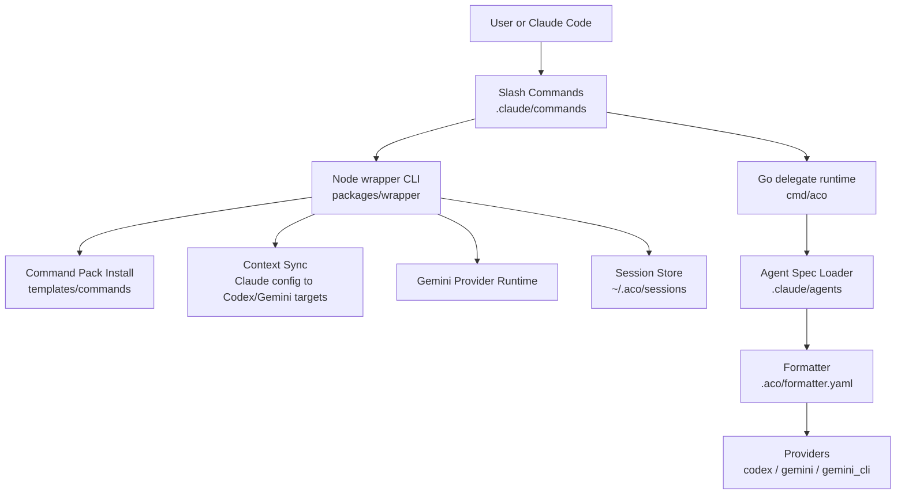
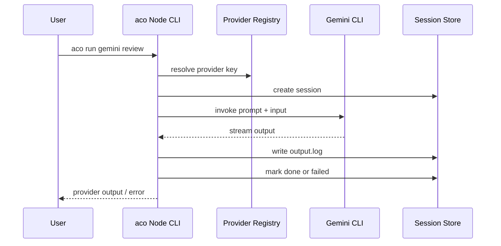
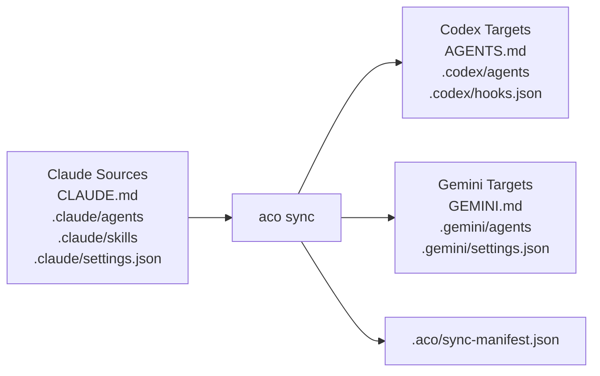
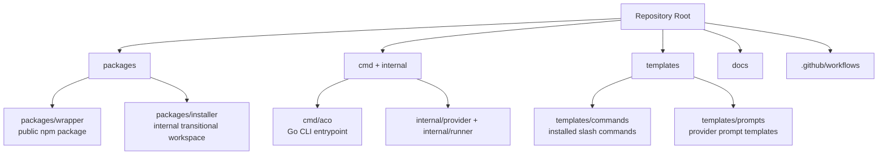

# Architecture

`ai-cli-orch-wrapper`는 Claude Code에서 외부 AI CLI를 쓰기 쉽게 만드는 command
pack과 `aco` CLI 런타임을 함께 관리한다. 현재 저장소에는 두 실행면이 있다.

- **Public npm package**: `@pureliture/ai-cli-orch-wrapper`가 배포하는 Node.js
  wrapper CLI. 설치, command pack 배치, `aco sync`, Gemini 실행, 세션 로그를 담당한다.
- **Go runtime**: `cmd/aco/`의 blocking runtime. `aco delegate`와 `aco run`을 통해
  agent frontmatter 기반 provider 실행을 담당한다.

## Architecture Overview



## Public Package CLI

The repository now targets one public npm package and one public CLI:

```text
npm package: @pureliture/ai-cli-orch-wrapper
CLI: aco
```

`aco` owns both runtime commands and setup commands:

```text
aco run ...
aco pack install
aco pack setup
aco provider setup <name>
```

The Node.js wrapper currently registers the Gemini provider for `aco run`. It also owns
session commands:

```text
aco result [--session <id>]
aco status [--session <id>]
aco cancel [--session <id>]
```

## Go Delegate Runtime

The Go runtime is blocking and process-oriented. It does not use the Node session store.

```text
aco delegate <agent-id> [--input <text>] [--formatter <path>] [--timeout <secs>]
aco run <provider> <command> [options]
```

Provider/model selection for `aco delegate` comes from the agent spec plus formatter:

1. Load `.claude/agents/<agent-id>.md`
2. Read `modelAlias` and `roleHint` from frontmatter
3. Resolve provider/model through `.aco/formatter.yaml`
4. Fall back to the default formatter route when no explicit route matches

The Go provider registry currently registers `codex`, `gemini`, and `gemini_cli`.

## Session Lifecycle

Node wrapper sessions are created only for `aco run <provider> <command>` in
`packages/wrapper`. The session store writes task metadata and provider output under
`~/.aco/sessions/<uuid>/`.



## Context Sync

`aco sync` turns Claude Code project configuration into Codex and Gemini project-level
targets. It reads canonical Claude files from the repository and writes managed outputs
with hash tracking in `.aco/sync-manifest.json`.



Use [reference/context-sync.md](reference/context-sync.md) for field conversion rules,
warnings, and conflict handling.

## Repository Layout

```text
packages/
  wrapper/     # public package implementation
  installer/   # internal transitional workspace (not public)
templates/
  commands/    # copied to .claude/commands/
  prompts/     # copied to .claude/aco/prompts/
```



| Path                  | Purpose                                                       |
| --------------------- | ------------------------------------------------------------- |
| `packages/wrapper/`   | Public npm package implementation for the Node.js `aco` CLI   |
| `packages/installer/` | Internal transitional workspace, not a public package surface |
| `cmd/aco/`            | Go CLI entrypoint for blocking `aco run` and `aco delegate`   |
| `internal/provider/`  | Go provider implementations and provider registry             |
| `internal/runner/`    | Go process execution and signal/timeout handling              |
| `templates/commands/` | Slash command templates copied to `.claude/commands/`         |
| `templates/prompts/`  | Provider prompt templates copied to `.claude/aco/prompts/`    |
| `.github/workflows/`  | CI, release, and project synchronization workflows            |

## Key Decisions

### D1: Single public package

Only `@pureliture/ai-cli-orch-wrapper` is intended to be published. Internal workspaces may remain during migration, but they are not part of the public API.

### D2: Single public CLI

`aco` is the only public command. Historical installer functionality is routed through:

- `aco pack install`
- `aco pack setup`
- `aco pack status`
- `aco provider setup <name>`

### D3: Runtime lifecycle remains in wrapper

The `aco` CLI still owns:

- provider dispatch
- session/task lifecycle
- output/error log handling
- cancellation/status commands

### D4: Pack installation is file copy

`aco pack install` copies templates from `templates/commands/` into `.claude/commands/`. Symlinks are still avoided because they are fragile across Node version manager changes.

### D5: Context sync uses managed outputs

`aco sync` owns generated Codex/Gemini target blocks and records hashes in
`.aco/sync-manifest.json`. Drifted manifest-owned targets are not overwritten unless the
operator chooses `aco sync --force`.
