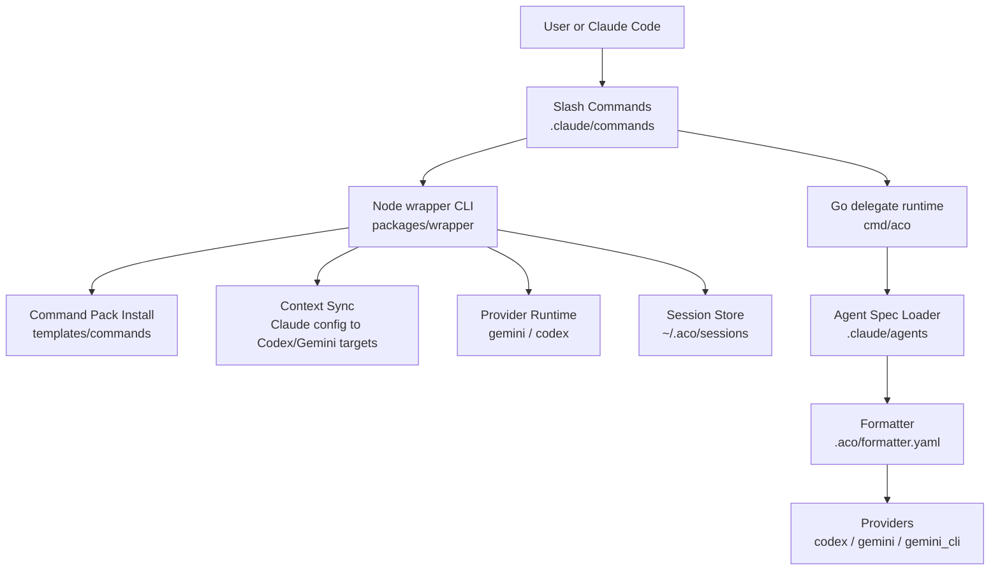
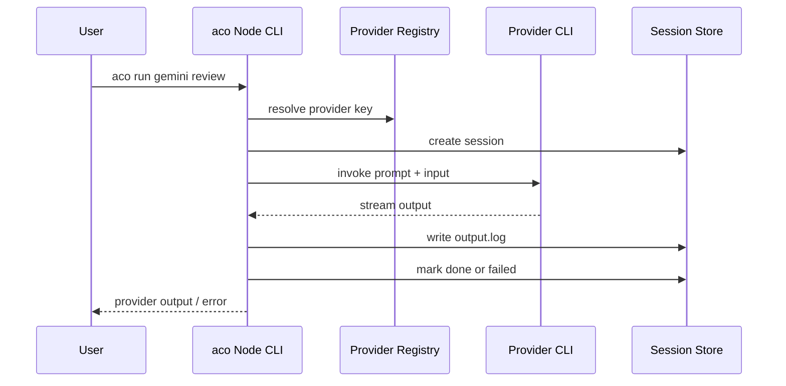
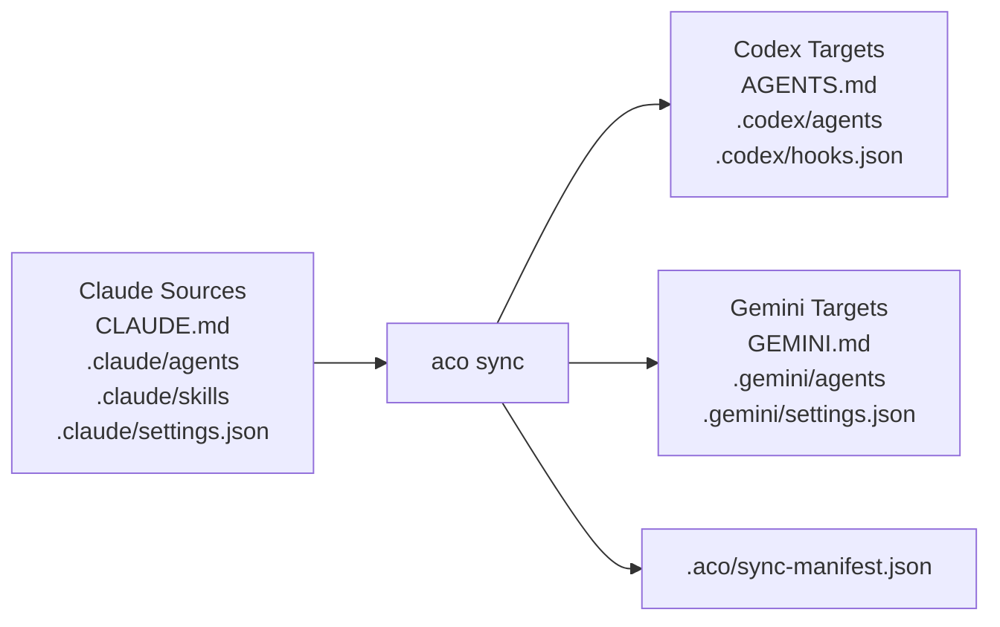
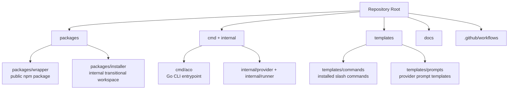

# 아키텍처

`ai-cli-orch-wrapper`는 Claude Code에서 외부 AI CLI를 쓰기 쉽게 만드는 command
pack과 `aco` CLI 런타임을 함께 관리한다. 현재 저장소에는 두 실행면이 있다.

- **공개 npm 패키지**: `@pureliture/ai-cli-orch-wrapper`가 배포하는 Node.js
  wrapper CLI. 설치, command pack 배치, `aco sync`, provider 실행, 세션 로그를 담당한다.
- **Go 런타임**: `cmd/aco/`의 blocking runtime. `aco delegate`와 `aco run`을 통해
  agent frontmatter 기반 provider 실행을 담당한다.

문서 기준 주요 provider는 **gemini**와 **codex**다.

## 아키텍처 개요



## 공개 패키지 CLI

이 저장소는 하나의 공개 npm 패키지와 하나의 공개 CLI를 대상으로 한다:

```text
npm package: @pureliture/ai-cli-orch-wrapper
CLI: aco
```

`aco`는 런타임 명령과 설정 명령을 모두 담당한다:

```text
aco run ...
aco pack install
aco pack setup
aco provider setup <name>
```

Node.js 래퍼는 gemini와 codex provider 흐름을 지원한다. 세션 명령도 담당한다:

```text
aco result [--session <id>]
aco status [--session <id>]
aco cancel [--session <id>]
```

## Go Delegate 런타임

Go 런타임은 blocking 방식이며 프로세스 중심으로 동작한다. Node 세션 저장소는 사용하지 않는다.

```text
aco delegate <agent-id> [--input <text>] [--formatter <path>] [--timeout <secs>]
aco run <provider> <command> [options]
```

`aco delegate`의 provider/model 선택은 agent spec과 formatter를 함께 사용해 결정한다:

1. `.claude/agents/<agent-id>.md`를 로드한다.
2. frontmatter에서 `modelAlias`와 `roleHint`를 읽는다.
3. `.aco/formatter.yaml`을 통해 provider/model을 해석한다.
4. 명시적으로 일치하는 route가 없으면 기본 formatter route로 폴백한다.

Go provider registry에는 현재 `codex`, `gemini`, `gemini_cli`가 등록되어 있다.

## 세션 생명주기

Node 래퍼 세션은 `packages/wrapper`의 `aco run <provider> <command>`에서만 생성된다.
세션 저장소는 태스크 메타데이터와 provider 출력을 `~/.aco/sessions/<uuid>/` 아래에 기록한다.



## Context 동기화

`aco sync`는 Claude Code 프로젝트 설정을 Codex와 Gemini의 프로젝트 단위 대상 파일로 변환한다.
저장소의 canonical Claude 파일을 읽고, `.aco/sync-manifest.json`에 해시를 추적하는 관리 산출물을 쓴다.



필드 변환 규칙, 경고, 충돌 처리 방식은 [reference/context-sync.md](reference/context-sync.md)를 참고한다.

## 저장소 구조

```text
packages/
  wrapper/     # public package implementation
  installer/   # internal transitional workspace (not public)
templates/
  commands/    # copied to .claude/commands/
  prompts/     # copied to .claude/aco/prompts/
```



| 경로                  | 목적                                                          |
| --------------------- | ------------------------------------------------------------- |
| `packages/wrapper/`   | Node.js `aco` CLI를 구현하는 공개 npm 패키지                  |
| `packages/installer/` | 공개 패키지 표면이 아닌 내부 전환용 workspace                 |
| `cmd/aco/`            | blocking `aco run`과 `aco delegate`를 위한 Go CLI 진입점      |
| `internal/provider/`  | Go provider 구현체와 provider registry                        |
| `internal/runner/`    | Go 프로세스 실행과 signal/timeout 처리                        |
| `templates/commands/` | `.claude/commands/`로 복사되는 slash command 템플릿           |
| `templates/prompts/`  | `.claude/aco/prompts/`로 복사되는 provider prompt 템플릿      |
| `.github/workflows/`  | CI, release, project 동기화 workflow                          |

## 주요 결정

### D1: 단일 공개 패키지

배포 대상은 `@pureliture/ai-cli-orch-wrapper` 하나뿐이다. 마이그레이션 중 내부 workspace가 남을 수 있지만, 공개 API에는 포함하지 않는다.

### D2: 단일 공개 CLI

`aco`만 공개 명령으로 둔다. 기존 installer 기능은 다음 명령으로 라우팅한다:

- `aco pack install`
- `aco pack setup`
- `aco pack status`
- `aco provider setup <name>`

### D3: 런타임 생명주기는 wrapper가 유지

`aco` CLI는 계속 다음 책임을 가진다:

- provider dispatch
- session/task 생명주기
- output/error 로그 처리
- cancellation/status 명령

### D4: Pack 설치는 파일 복사

`aco pack install`은 `templates/commands/`의 템플릿을 `.claude/commands/`로 복사한다. Node version manager 변경에 취약하므로 symlink는 계속 피한다.

### D5: Context sync는 관리 산출물을 사용

`aco sync`는 생성된 Codex/Gemini 대상 block을 소유하고 `.aco/sync-manifest.json`에 해시를 기록한다.
manifest가 소유한 대상에 drift가 있으면 운영자가 `aco sync --force`를 선택하기 전까지 덮어쓰지 않는다.
