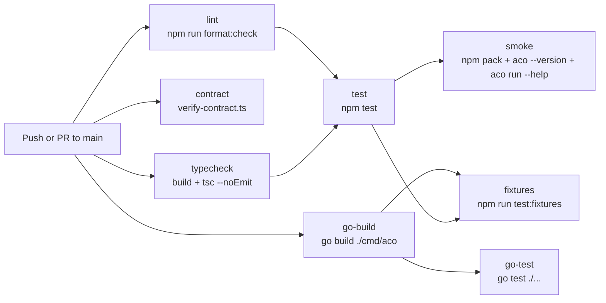

# GitHub Workflow 가이드

이슈·PR 작성 규약과 슬래시 커맨드 운영 가이드. 필드·뷰·ID 등 보드 구성
자체의 참조 정보는 [reference/project-board.md](../reference/project-board.md)
를 참고한다.

문서 기준 주요 provider는 **gemini**와 **codex**다.

## Claude Code 하네스 구조

이 저장소는 repo-local `.claude/` 하네스를 기준으로 PM workflow와 OpenSpec 명령을
운영한다. 패키지 설치 대상 사용자는 `aco pack install` 또는 `aco pack setup`으로
`templates/commands/`와 `templates/prompts/`를 `.claude/` 아래에 복사한다.

```text
.claude/
├── agents/             # Claude Code agent 정의
├── commands/           # 이 저장소에서 사용하는 slash command
├── skills/             # Local workflow skill
├── aco/
│   └── prompts/        # Provider prompt 템플릿
├── settings.json       # 공유 Claude Code 설정
└── settings.local.json # local-only 설정, portable contract 아님
```

생성된 provider 대상 파일은 `.claude/` 밖에 둔다:

```text
AGENTS.md
GEMINI.md
.codex/agents/
.codex/hooks.json
.gemini/agents/
.gemini/settings.json
.aco/sync-manifest.json
```

생성된 Codex/Gemini context를 사용하기 전에 `aco sync --check`를 실행한다. 관리 대상 파일을 갱신하려면
`aco sync`를 실행하고, manifest 소유 drift를 의도적으로 덮어써도 되는 경우에만 `aco sync --force`를 사용한다.

## 명령 구조 (V3+)

PM workflow 자동화는 세 축의 명령으로 구성된다:

| 축        | 명령                                              | 목적                       |
| --------- | ------------------------------------------------- | -------------------------- |
| `/opsx:*` | `opsx:propose`, `opsx:apply`, `opsx:archive`      | OpenSpec change 생명주기   |
| `/gh-*`   | `gh-issue`, `gh-start`, `gh-pr`, `gh-pr-followup` | GitHub issue/PR 운영       |
| `/octo:*` | `octo:multi`, `octo:review`, `octo:tdd`, …        | Multi-AI orchestration     |

## Slash Command 목록

### GitHub PM 명령

| 명령                    | 동작                                                                                                                                                                 |
| ----------------------- | -------------------------------------------------------------------------------------------------------------------------------------------------------------------- |
| `/gh-issue`             | issue 생성 + `type:*` + priority + 선택한 `sprint:v*` label + Project #3 Backlog 등록                                                                                |
| `/gh-start #N`          | In Progress 전환 + `status:in-progress` label + branch 생성                                                                                                          |
| `/gh-pr`                | PR 생성 + `Closes #N` + 추적 label 상속 (`type:*`, `area:*`, `origin:review`, `p*`) + PR/issue Project status → In Review + CI checklist + Epic reminder             |
| `/gh-pr-followup`       | PR review thread triage (즉시 수정 + 답변/resolve 또는 새 issue로 이연)                                                                                              |
| `/gh-issue:multi`       | multi-AI scope 검증이 포함된 `/gh-issue`                                                                                                                             |
| `/gh-start:multi`       | multi-AI readiness check가 포함된 `/gh-start`                                                                                                                        |
| `/gh-pr:multi`          | multi-AI PR readiness 검증이 포함된 `/gh-pr`                                                                                                                         |
| `/gh-pr-followup:multi` | multi-AI content 검증이 포함된 `/gh-pr-followup`                                                                                                                     |

### OpenSpec 명령

| 명령                 | 동작                                                                 |
| -------------------- | -------------------------------------------------------------------- |
| `/opsx:new`          | artifact workflow로 새 OpenSpec change 시작                          |
| `/opsx:propose`      | change를 만들고 proposal, design, tasks를 한 번에 생성               |
| `/opsx:continue`     | 기존 change에서 다음으로 필요한 artifact를 만들어 계속 진행          |
| `/opsx:apply`        | OpenSpec change의 pending task 구현                                  |
| `/opsx:verify`       | 구현을 change artifact와 대조해 검증                                 |
| `/opsx:sync`         | change의 delta spec을 main spec으로 동기화                           |
| `/opsx:archive`      | 완료된 change 하나를 archive                                         |
| `/opsx:bulk-archive` | 완료된 change 여러 개를 archive                                      |

### 저장소 유틸리티 명령

| 명령         | 동작                                   |
| ------------ | -------------------------------------- |
| `/review`    | 현재 작업에 대한 review workflow 실행  |
| `/research`  | 저장소 research workflow 실행          |
| `/pm-status` | PM/project 상태 확인                   |
| `/pm-triage` | PM backlog 항목 triage                 |
| `/execute`   | 준비된 구현 계획 실행                  |

패키지에 포함된 템플릿은 현재 `templates/commands/` 아래의 `/gh-*` 명령과 provider helper 명령을 포함한다.
repo-local `.claude/commands/`에는 maintainer가 사용하는 추가 명령이 있을 수 있다.

## Issue 작성 규칙

sprint planning에는 sprint epic 하나와 child issue들을 사용한다.

### 제목 규칙 (V3+)

**V3부터** issue 제목은 conventional commit 형식을 사용한다. `[Sprint V*][Type]` prefix는 deprecated 상태다.

```text
feat: add gh-pm-workflow-commands
fix: handle null session in wrapper
chore: update typescript deps
bug: codex auth failure classification unreachable
spike: investigate gemini streaming API
```

규칙:

- `type: description` 형식을 사용한다. 제목에는 sprint 또는 type prefix를 넣지 않는다.
- Type은 제목이 아니라 `type:*` label로 표현한다.
- Sprint는 제목이 아니라 `sprint:v*` label로 표현한다.
- Priority와 area는 제목에 넣지 않는다. `p0`/`p1`/`p2`와 `area:*` label을 사용한다.
- **Epic 관계**:
  - Child issue는 GitHub native `Parent issue` 필드로 parent issue에 연결해야 한다.
  - 본문 첫 줄의 `Parent epic: #N`은 portable fallback으로 유지한다.
  - Sprint epic은 가시성을 위해 본문에 `Child Issues` 체크리스트를 유지하는 것이 좋다.
- **Project 필드**:
  - 모든 issue는 Project #3에 추가해야 한다.
  - 초기 `Status`는 `Backlog`로 설정해야 한다.
  - `Priority` (`P0`/`P1`/`P2`)는 label에서 Project field로 mirror해야 한다.

### Issue 본문 템플릿

`/gh-issue`는 빈 placeholder가 아니라 실행 가능한 issue 본문을 만들어야 한다. 모든 issue 본문은 다음 내용을 포함해야 한다:

```md
[Parent epic: #N]

## Purpose

<문제 또는 목표를 설명하는 1-3문장>

## Scope & Requirements

- [ ] <구체적인 요구사항 또는 task>
- [ ] <구체적인 요구사항 또는 task>

## Acceptance Criteria

- [ ] <관찰 가능한 완료 조건>
```

규칙:

- parent epic이 있으면 `Parent epic: #N`을 템플릿 섹션보다 앞선 첫 줄에 둔다.
- issue 본문 prose와 checklist item 설명은 기본적으로 한국어로 작성한다. conventional title prefix, label, file path, command name, 확립된 Markdown heading은 원문을 유지한다.
- 필요한 섹션을 채우기에 맥락이 너무 모호하면 생성 전에 간결한 follow-up 질문을 최대 두 개만 한다.
- 여러 줄 Markdown issue 본문에는 `--body-file`을 사용해 heading, checkbox, code span이 보존되도록 한다.
- `<...>`, `TBD`, `TODO` 같은 placeholder text가 포함된 issue 본문은 만들지 않는다.

**Legacy format** (V3 이전, 참고용):

```text
[Sprint V3][Epic] PM 하네스 구축 — GitHub Projects + Actions + Claude Code
[Sprint V3][Task] GitHub Actions CI 파이프라인 구현
```

PR 제목 형식:

```text
feat(pm-harness): implement GitHub Projects + Actions + Claude Code PM harness
```

PR 제목 규칙:

- conventional commit style인 `type(scope): description`을 사용한다. 72자 이내로 유지한다.
- `[Sprint]`, `[Task]`, `[Epic]` prefix를 붙이지 않는다.
- sprint 범위 PR은 PM project에 추가하고 PR `Status`를 `In Review`로 설정한다.
- `Size`와 `Sprint`는 issue에만 유지한다. 이 planning field를 PR item으로 mirror하지 않는다.
- 연결된 issue에 `type:*`, `area:*`, `origin:review`, priority `p*` label이 있으면 PR에 상속한다.
- `status:*` 또는 `sprint:*` label은 PR에 복사하지 않는다.

### PR 본문 가이드

모든 PR 본문은 네 섹션을 포함해야 한다. `/gh-pr`는 이 구조를 강제한다.

```markdown
Closes #N

## What

구체적으로 무엇이 바뀌었는지 작성한다. 새로 추가되거나 달라진 파일, 명령, 동작을 명시한다.
issue를 읽지 않은 reviewer도 이 문단만으로 변경을 이해할 수 있어야 한다. 2-4문장.

## Why

왜 필요했는지 작성한다. 제목을 반복하는 수준을 넘어서 동기를 설명한다.
issue의 문제 또는 제약을 참조한다. 1-3문장.

## Changes

- Add `path/to/file.md` — 한 줄 설명
- Fix `scripts/foo.sh` — 무엇이 깨졌고 어떻게 고쳤는지
- Update `docs/bar.md` — 무엇을 추가하거나 변경했는지

## Checklist

- [ ] npm test passes
- [ ] manual smoke test
- [ ] docs updated if needed
```

**품질 기준** — 다음 경우 PR 본문은 실패로 본다:

- 섹션 중 하나가 비어 있거나 placeholder text만 포함한다.
- "What"이 구체적인 내용을 추가하지 않고 제목만 반복한다.
- "Why"가 추가 맥락 없이 "see issue"라고만 말한다.
- "Changes"가 "updated files" 같은 모호한 bullet 하나뿐이다.

제출 전에 `/gh-pr:multi`로 본문에 대한 multi-AI 검증을 받는다.

### `origin:review` Label 사용법

PR review feedback에서 만들어진 issue를 추적하려면 `origin:review` label을 사용한다:

- review에서 드러난 개선 또는 feature에는 `origin:review` + `type:task`를 적용한다.
- review에서 드러난 refactoring task에는 `origin:review` + `type:chore`를 적용한다.
- review에서 발견된 결함에는 `origin:review` + `type:bug`를 적용한다.
- 평가와 생성을 위해 항상 `/gh-pr-followup` 명령을 사용한다. 이 명령은 본문 형식과 label 할당을 자동 처리한다.
- issue 본문은 `From: #<PR> review comment`로 시작하고 `See also: #<PR>`로 끝나야 한다.

자동화 규칙:

```text
gh pr create → PR item Status = In Review
             → linked issue #N Status = In Review
```

표준화된 제목과 본문은 다음 명령으로 생성한다:

```bash
python3 .claude/skills/github-jira-ops/scripts/make_issue_body.py \
  --type task \
  --sprint V3 \
  --title "GitHub Actions CI 파이프라인 구현" \
  --summary "PM harness CI workflow 구현" \
  --parent "#22" \
  --acceptance "[ ] lint/typecheck/test/smoke job 분리" \
  --acceptance "[ ] go test ./... 통과" \
  --format all
```

## Agent 설정

Claude agent 파일은 `.claude/agents/<id>.md`에 둔다. repo-local agent 파일은 `name`, `description`, `tools`, `model` 같은 Claude Code frontmatter를 사용한다.

```yaml
---
name: code-reviewer
description: Expert code review specialist
tools: ['Read', 'Grep', 'Glob', 'Bash']
model: sonnet
---
```

Go delegate 런타임은 agent frontmatter에서 routing 지향 필드도 읽을 수 있다:

```yaml
---
id: backend-reviewer
modelAlias: codex-pro
roleHint: backend
permissionProfile: restricted
reasoningEffort: high
---
```

`aco delegate <agent-id>`의 routing 해석 순서:

1. `.claude/agents/<agent-id>.md`를 로드한다.
2. `.aco/formatter.yaml`에 매핑이 있으면 `modelAlias`를 우선 사용한다.
3. 설정되어 있으면 `roleHint` provider preference를 적용한다.
4. formatter fallback route로 폴백한다.

현재 문서화된 provider는 `codex`와 `gemini`다. Go 런타임은 delegation 호환성을 위해 `gemini_cli`도 등록한다.

## CI/CD Workflow



| Job         | 명령 표면                                                                                         | 역할                                              |
| ----------- | ------------------------------------------------------------------------------------------------- | ------------------------------------------------- |
| `lint`      | `npm run format:check`                                                                            | TypeScript source format gate                     |
| `contract`  | `npx tsx scripts/verify-contract.ts`                                                              | Go/Node provider interface drift 검사             |
| `typecheck` | `npm run build --workspace=packages/wrapper`와 `npm run typecheck --workspace=packages/wrapper`   | build 및 TypeScript type 검증                     |
| `test`      | `npm test --workspace=packages/wrapper`                                                           | Node wrapper 단위 테스트                          |
| `go-build`  | `go build ./cmd/aco`                                                                              | Go CLI 컴파일                                     |
| `go-test`  | `go test ./...`                                                                                   | Go 단위 테스트                                    |
| `smoke`     | `npm pack`, local install, `aco --version`, `aco run --help`                                      | 배포 패키지 smoke 경로                            |
| `fixtures`  | `npm run test:fixtures -- --binary ./aco`                                                         | Go 바이너리에 대한 cross-runtime fixture suite    |

Release publish는 CI와 분리되어 있다. `.github/workflows/release.yml`은 수동으로 실행되거나 merge된 PR에 `release` label이 있을 때 실행되며, versioning/publish 동작은 Changesets에 위임한다.
