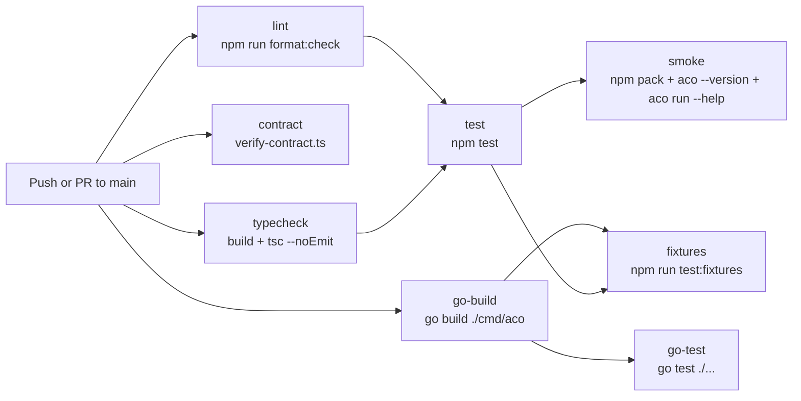

# GitHub Workflow Guide

이슈·PR 작성 규약과 슬래시 커맨드 운영 가이드. 필드·뷰·ID 등 보드 구성
자체의 참조 정보는 [reference/project-board.md](../reference/project-board.md)
를 참고한다.

문서 기준 주요 provider는 **gemini**와 **codex**다.

## Claude Code Harness Layout

이 저장소는 repo-local `.claude/` 하네스를 기준으로 PM workflow와 OpenSpec 명령을
운영한다. 패키지 설치 대상 사용자는 `aco pack install` 또는 `aco pack setup`으로
`templates/commands/`와 `templates/prompts/`를 `.claude/` 아래에 복사한다.

```text
.claude/
├── agents/             # Claude Code agent definitions
├── commands/           # Slash commands used by this repo
├── skills/             # Local workflow skills
├── aco/
│   └── prompts/        # Provider prompt templates
├── settings.json       # Shared Claude Code settings
└── settings.local.json # Local-only settings, not a portable contract
```

Generated provider targets live outside `.claude/`:

```text
AGENTS.md
GEMINI.md
.codex/agents/
.codex/hooks.json
.gemini/agents/
.gemini/settings.json
.aco/sync-manifest.json
```

Run `aco sync --check` before relying on generated Codex/Gemini context. Run
`aco sync` to refresh managed targets, and use `aco sync --force` only when the
operator intentionally accepts overwriting manifest-owned drift.

## Command Structure (V3+)

Three command axes for PM workflow automation:

| Axis      | Commands                                          | Purpose                    |
| --------- | ------------------------------------------------- | -------------------------- |
| `/opsx:*` | `opsx:propose`, `opsx:apply`, `opsx:archive`      | OpenSpec change lifecycle  |
| `/gh-*`   | `gh-issue`, `gh-start`, `gh-pr`, `gh-pr-followup` | GitHub issue/PR operations |
| `/octo:*` | `octo:multi`, `octo:review`, `octo:tdd`, …        | Multi-AI orchestration     |

## Slash Command Inventory

### GitHub PM commands

| Command                 | What it does                                                                                                                                                         |
| ----------------------- | -------------------------------------------------------------------------------------------------------------------------------------------------------------------- |
| `/gh-issue`             | Create issue + `type:*` + priority + selected `sprint:v*` labels + Project #3 Backlog                                                                                |
| `/gh-start #N`          | In Progress transition + `status:in-progress` label + branch creation                                                                                                |
| `/gh-pr`                | PR create + `Closes #N` + inherited tracking labels (`type:*`, `area:*`, `origin:review`, `p*`) + PR/issue Project status → In Review + CI checklist + Epic reminder |
| `/gh-pr-followup`       | PR review threads triage (immediate fix + reply/resolve OR new issue deferral)                                                                                       |
| `/gh-issue:multi`       | `/gh-issue` with multi-AI scope validation                                                                                                                           |
| `/gh-start:multi`       | `/gh-start` with multi-AI readiness check                                                                                                                            |
| `/gh-pr:multi`          | `/gh-pr` with multi-AI PR readiness validation                                                                                                                       |
| `/gh-pr-followup:multi` | `/gh-pr-followup` with multi-AI content validation                                                                                                                   |

### OpenSpec commands

| Command              | What it does                                                         |
| -------------------- | -------------------------------------------------------------------- |
| `/opsx:new`          | Start a new OpenSpec change using the artifact workflow              |
| `/opsx:propose`      | Create a change and generate proposal, design, and tasks in one pass |
| `/opsx:continue`     | Continue an existing change by creating the next required artifact   |
| `/opsx:apply`        | Implement pending tasks from an OpenSpec change                      |
| `/opsx:verify`       | Verify implementation against change artifacts                       |
| `/opsx:sync`         | Sync delta specs from a change to main specs                         |
| `/opsx:archive`      | Archive one completed change                                         |
| `/opsx:bulk-archive` | Archive multiple completed changes                                   |

### Repository utility commands

| Command      | What it does                           |
| ------------ | -------------------------------------- |
| `/review`    | Run review workflow for current work   |
| `/research`  | Run repository research workflow       |
| `/pm-status` | Inspect PM/project status              |
| `/pm-triage` | Triage PM backlog items                |
| `/execute`   | Execute a prepared implementation plan |

Packaged templates currently include the `/gh-*` commands and provider helper commands under
`templates/commands/`. Repo-local `.claude/commands/` may include additional commands used
by maintainers.

## Issue Authoring Rules

Use one sprint epic plus child issues for sprint planning.

### Title Convention (V3+)

**From V3 onward**, issue titles use conventional commit format. The `[Sprint V*][Type]` prefix is deprecated.

```text
feat: add gh-pm-workflow-commands
fix: handle null session in wrapper
chore: update typescript deps
bug: codex auth failure classification unreachable
spike: investigate gemini streaming API
```

Rules:

- Use `type: description` format (no sprint or type prefix in title).
- Type is conveyed via the `type:*` label, not the title.
- Sprint is conveyed via the `sprint:v*` label, not the title.
- Keep priority and area out of titles; use `p0`/`p1`/`p2` and `area:*` labels.
- **Epic Relationship**:
  - Child issues MUST be linked to a parent issue via GitHub's native `Parent issue` field.
  - Body-level `Parent epic: #N` is maintained as a portable fallback (first line of body).
  - Sprint epics should maintain a `Child Issues` checklist in the body for visibility.
- **Project Fields**:
  - Every issue MUST be added to Project #3.
  - Initial `Status` must be set to `Backlog`.
  - `Priority` (`P0`/`P1`/`P2`) must be mirrored from label to Project field.

### Issue Body Template

`/gh-issue` must create actionable issue bodies, not empty placeholders. Every issue body should include:

```md
[Parent epic: #N]

## Purpose

<1-3 sentences explaining the problem or goal>

## Scope & Requirements

- [ ] <Concrete requirement or task>
- [ ] <Concrete requirement or task>

## Acceptance Criteria

- [ ] <Observable completion condition>
```

Rules:

- If a parent epic exists, `Parent epic: #N` remains the first line before the template sections.
- Write issue body prose and checklist item descriptions in Korean by default. Keep conventional title prefixes, labels, file paths, command names, and established Markdown headings in their original language.
- Ask at most two concise follow-up questions before creation when the available context is too vague to fill the required sections.
- Use `--body-file` for multiline Markdown issue bodies so headings, checkboxes, and code spans are preserved.
- Do not create an issue body containing placeholder text such as `<...>`, `TBD`, or `TODO`.

**Legacy format** (pre-V3, for reference only):

```text
[Sprint V3][Epic] PM 하네스 구축 — GitHub Projects + Actions + Claude Code
[Sprint V3][Task] GitHub Actions CI 파이프라인 구현
```

PR title format:

```text
feat(pm-harness): implement GitHub Projects + Actions + Claude Code PM harness
```

PR title rules:

- Use conventional commit style: `type(scope): description`. Keep under 72 characters.
- Do not add `[Sprint]`, `[Task]`, or `[Epic]` prefixes.
- Add sprint-scoped PRs to the PM project and set PR `Status` to `In Review`.
- Keep `Size` and `Sprint` on issues; do not mirror those planning fields onto PR items.
- Inherit `type:*`, `area:*`, `origin:review`, and priority `p*` labels from the linked issue when available.
- Do not copy `status:*` or `sprint:*` labels onto the PR.

### PR Body Guide

Every PR body must contain four sections. `/gh-pr` enforces this structure.

```markdown
Closes #N

## What

What changed, specifically. Name the files, commands, or behaviors that are new
or different. A reviewer who hasn't read the issue should understand the change
from this paragraph alone. 2–4 sentences.

## Why

Why was this needed? The motivation beyond restating the title. Reference the
problem or constraint from the issue. 1–3 sentences.

## Changes

- Add `path/to/file.md` — one-line description
- Fix `scripts/foo.sh` — what was broken and how it's fixed
- Update `docs/bar.md` — what was added or changed

## Checklist

- [ ] npm test passes
- [ ] manual smoke test
- [ ] docs updated if needed
```

**Quality bar** — a PR body fails if:

- Any section is empty or contains only placeholder text
- "What" restates the title without adding specifics
- "Why" says "see issue" with no additional context
- "Changes" is a single vague bullet like "updated files"

Use `/gh-pr:multi` to get multi-AI validation of the body before submission.

### `origin:review` Label Usage

Use the `origin:review` label to track issues created from PR review feedback:

- Apply `origin:review` + `type:task` for improvements or features surfaced in review.
- Apply `origin:review` + `type:chore` for refactoring tasks surfaced in review.
- Apply `origin:review` + `type:bug` for defects found during review.
- Always use `/gh-pr-followup` command to evaluate and create these — it handles the body format and label assignment automatically.
- The issue body must begin with `From: #<PR> review comment` and end with `See also: #<PR>`.

Automation rule:

```text
gh pr create → PR item Status = In Review
             → linked issue #N Status = In Review
```

Generate standardized titles and bodies with:

```bash
python3 .claude/skills/github-jira-ops/scripts/make_issue_body.py \
  --type task \
  --sprint V3 \
  --title "GitHub Actions CI 파이프라인 구현" \
  --summary "Implement the PM harness CI workflow." \
  --parent "#22" \
  --acceptance "[ ] lint/typecheck/test/smoke jobs are split" \
  --acceptance "[ ] go test ./... passes" \
  --format all
```

## Agent Configuration

Claude agent files live in `.claude/agents/<id>.md`. The repo-local agent files use Claude
Code frontmatter such as `name`, `description`, `tools`, and `model`.

```yaml
---
name: code-reviewer
description: Expert code review specialist
tools: ['Read', 'Grep', 'Glob', 'Bash']
model: sonnet
---
```

The Go delegate runtime can also consume routing-oriented fields from agent frontmatter:

```yaml
---
id: backend-reviewer
modelAlias: codex-pro
roleHint: backend
permissionProfile: restricted
reasoningEffort: high
---
```

Routing resolution for `aco delegate <agent-id>` is:

1. Load `.claude/agents/<agent-id>.md`
2. Prefer `modelAlias` when `.aco/formatter.yaml` maps it
3. Apply `roleHint` provider preference when configured
4. Fall back to the formatter fallback route

Current documented providers are `codex` and `gemini`. The Go runtime also registers
`gemini_cli` for delegation compatibility.

## CI/CD Workflow



| Job         | Command surface                                                                                   | Role                                              |
| ----------- | ------------------------------------------------------------------------------------------------- | ------------------------------------------------- |
| `lint`      | `npm run format:check`                                                                            | TypeScript source formatting gate                 |
| `contract`  | `npx tsx scripts/verify-contract.ts`                                                              | Go/Node provider interface drift check            |
| `typecheck` | `npm run build --workspace=packages/wrapper` and `npm run typecheck --workspace=packages/wrapper` | Build and TypeScript type validation              |
| `test`      | `npm test --workspace=packages/wrapper`                                                           | Node wrapper unit tests                           |
| `go-build`  | `go build ./cmd/aco`                                                                              | Go CLI compilation                                |
| `go-test`  | `go test ./...`                                                                                   | Go unit tests                                     |
| `smoke`     | `npm pack`, local install, `aco --version`, `aco run --help`                                      | Published package smoke path                      |
| `fixtures`  | `npm run test:fixtures -- --binary ./aco`                                                         | Cross-runtime fixture suite against the Go binary |

Release publishing is separate from CI. `.github/workflows/release.yml` runs manually or
when a merged PR has the `release` label, then delegates versioning/publish behavior to
Changesets.
