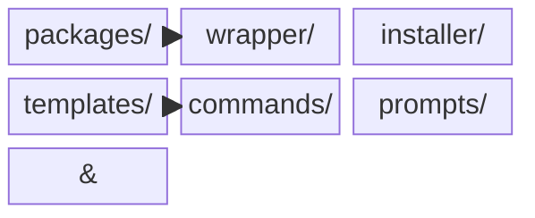

# Phase 1 계획 — 문서 품질 개선 (기준선 확보)

**생성 이슈:** #62

**선행 조건:** 없음 (바로 진행 가능)

**목적:** 문서 품질의 기준선(baseline) 확보. 가장 많은 사용자가 접하는 파일 3개에 집중하여, 이후 Phase 2·3 개선의 토대를 마련.

---

## 대상 독자

- **사용자**: 패키지 설치·운영하는 사용자
- **운영자**: CI/CD 및 Claude Code 하네스 구성 관리자

> 기여자(contributor) 가이드는 이 단계에서 **제외** — Phase 2에서 별도 처리

---

## 브레인스토밍 근거

### 왜 Phase 1인가

Issue #48에서 `docs/`를 4분류(architecture/contract/guides/reference)로 재편했으나, "내용 수정 없이 이동" 제약으로 인해 **새 구조에 맞는 콘텐츠 개선이 전혀 없었음**.

ccg-workflow-restore 문서와 비교했을 때:

- Mermaid/ASCII 다이어그램 없음
- 의사결정 트리 없음
- 코드그룹(OS별 설치 등) 없음
- 콜아웃(::: details) 없음

Phase 1은 이 기준선을 먼저 확보하는 것이 목표.

### 왜 3개 파일인가

| 파일                             | 선택 이유                                               |
| -------------------------------- | ------------------------------------------------------- |
| `docs/README.md`                 | 최상위 진입점, 모든 사용자가 먼저 보는 문서             |
| `docs/architecture.md`           | 아키텍처 이해의 출발점, 다이어그램缺席이 가장 두드러짐  |
| `docs/guides/github-workflow.md` | Claude Code 하네스 운영에 필수, 현재 참조 나열에 가까움 |

---

## 대상 파일별 개선 방향

### 1. `docs/README.md`

**현재 문제:**

- classification 표만 있고, 실질적 진입 안내가 없음
- "프로젝트 처음 접한 기여자"가 다음 행동이 뭔지 모르겠음

**개선 방향 (ccg-workflow-restore `index.md` 스타일):**

````markdown
## 빠른 시작

```bash
# 설치
npx @pureliture/ai-cli-orch-wrapper pack setup

# 프롬프트 동기화
aco sync
```
````

## 사용자/운영자용 Navigation

### 패키지 설치·운영하는 사용자

1. [guides/runbook.md](guides/runbook.md) — 설치·배포·트러블슈팅
2. [reference/context-sync.md](reference/context-sync.md) — `aco sync` 동작과 변환 규칙
3. [reference/project-board.md](reference/project-board.md) — Project #3 필드·뷰 정의

### Claude Code 하네스 관리자

1. [guides/github-workflow.md](guides/github-workflow.md) — 슬래시 커맨드, CI/CD
2. [architecture.md](architecture.md) — 전체 구조
3. [contract/go-node-boundary.md](contract/go-node-boundary.md) — Go/Node.js 책임 경계

## Phase 2 · 3 잔여

- **Phase 2**: 기여자 가이드 개선, 일관성 점검
- **Phase 3**: VitePress 도입, 검색 구조화

````

**참조:** ccg-workflow-restore `docs/guide/getting-started.md` — Quick Start + "CCG是什么" 섹션

---

### 2. `docs/architecture.md`

**현재 문제:**
- 텍스트 설명만 있고, 전체 구조를 한눈에 보여주는 다이어그램이 없음
- Claude Code ↔ Provider(Codex/Gemini) ↔ Session 관계가 시각적으로 안 드러남

**개선 방향 (Mermaid block diagram):**

```markdown
## 아키텍처 개요

```mermaid
block-beta
  columns 1

  block:orchestrator
    columns 2
    claude["Claude Code<br/>(Orchestrator)"]
    session["Session Store<br/>~/.aco/sessions/"]
  end

  block:providers
    columns 3
    codex["Codex<br/>(Backend)"]
    gemini["Gemini<br/>(Frontend)"]
    other["Future..."]
  end

  claude & session --> codex & gemini
````

## Provider Routing

`aco delegate`는 `.claude/agents/<id>.md` frontmatter의 `provider` 필드를 읽어서 라우팅:

- `provider: codex` → 후端 태스크 → Codex CLI
- `provider: gemini` → 前端 태스크 → Gemini CLI
- `provider: claudeaude` → 오케스트레이션/코드 작성 → Claude Code

## 세션 생명주기

```mermaid
sequenceDiagram
  participant User
  participant CLI as aco CLI
  participant Delegate as aco delegate
  participant Provider as Codex/Gemini
  participant Store as Session Store

  User->>CLI: aco run <provider> <command>
  CLI->>Delegate: spawn with agent spec
  Delegate->>Provider: exec with prompt
  Provider-->>Delegate: patch/result
  Delegate->>Store: save session
  Store-->>Delegate: session id
  Delegate-->>CLI: output
  CLI-->>User: display result
```

## 저장소 구조



| 디렉터리              | 용도                                                |
| --------------------- | --------------------------------------------------- |
| `packages/wrapper/`   | 공개 패키지 (`@pureliture/ai-cli-orch-wrapper`)     |
| `packages/installer/` | 내부 이전용 (공개 대상 아님)                        |
| `templates/commands/` | `.claude/commands/`로 복사 (슬래시 커맨드)          |
| `templates/prompts/`  | `.claude/aco/prompts/`로 복사 (provider별 프롬프트) |

````

**참조:** ccg-workflow-restore `docs/guide/getting-started.md`의 ASCII 아키텍처 다이어그램

---

### 3. `docs/guides/github-workflow.md`

**현재 문제:**
- 명령어 참조가 단순 나열
- Claude Code 하네스 구성 정보 부족
- 의사결정 트리 대신 **실제 운영에 필요한 정보** 필요

**개선 방향:**

```markdown
## Claude Code 하네스 구성

### 디렉터리 구조

````

~/.claude/
├── commands/ # 슬래시 커맨드 (aco pack install로 설치)
├── agents/ # 에이전트 정의
├── skills/ # 스킬 디렉터리
├── aco/
│ └── prompts/ # provider별 프롬프트 템플릿
└── settings.json # 환경변수, 훅 설정

````

### 슬래시 커맨드 인벤토리

| 슬래시 커맨드 | 용도 | 예시 |
|--------------|------|------|
| `/gh-issue` | GitHub 이슈 생성 | `/gh-issue feat: 사용자 인증 추가` |
| `/gh-start #N` | 이슈 시작 + 브랜치 생성 | `/gh-start #62` |
| `/gh-pr` | PR 생성 + Project 상태 동기화 | `/gh-pr` |
| `/gh-pr-followup` | 리뷰 스레드 처리 | `/gh-pr-followup` |
| `/opsx:propose` | OpenSpec 변경 제안 | `/opsx:propose` |
| `/opsx:apply` | OpenSpec 실행 | `/opsx:apply` |

### CI/CD 워크플로우

```mermaid
flowchart LR
    A[Push / PR] --> B[lint]
    B --> C[typecheck]
    C --> D[test]
    D --> E[smoke]
    E --> F{main branch?}
    F -->|Yes| G[Require PR]
    F -->|No| H[Skip]
````

**CI Jobs:**

| Job       | 명령                                   | 역할                 |
| --------- | -------------------------------------- | -------------------- |
| lint      | `npm run lint`                         | 코드 스타일 검사     |
| typecheck | `npm run typecheck`                    | TypeScript 타입 검사 |
| test      | `npm test`                             | 단위 테스트          |
| smoke     | `node packages/wrapper/tests/smoke.ts` | 엔드투엔드 테스트    |

### 에이전트 설정

`.claude/agents/<id>.md` frontmatter로 provider routing:

```yaml
---
name: backend-coder
description: Backend task specialist
provider: codex
model: codex-sonnet
---
```

`provider` 필드:

- `codex` → 후端 태스크
- `gemini` → 前端 태스크
- `claudeaude` → 오케스트레이션 (기본값)

```

**참조:** ccg-workflow-restore `docs/guide/commands.md` — 슬래시 커맨드 인벤토리 표

---

## 기대 효과 (Phase 1 완료 시)

| 지표 | 현재 | Phase 1 후 |
|------|------|------------|
| Mermaid 다이어그램 | 0개 | 2개 이상 |
| 코드그룹 | 0개 | 1개 이상 |
| 슬래시 커맨드 인벤토리 | 없음 | 포함 |
| CI/CD 워크플로우 설명 | 없음 | 포함 |
| Quick Start 섹션 | 없음 | docs/README.md에 존재 |

---

## 범위 (체크리스트)

- [x] `docs/README.md`
  - 빠른 시작 섹션 추가
  - 사용자/운영자 통합 진입점 제공 (기여자 내용 제외)
  - Phase 2·3 잔여 명시

- [x] `docs/architecture.md`
  - Mermaid block diagram (아키텍처 전체 구조)
  - Mermaid sequence diagram (세션 생명주기)
  - Mermaid block diagram (저장소 구조)

- [x] `docs/guides/github-workflow.md`
  - Claude Code 하네스 디렉터리 구조
  - 슬래시 커맨드 인벤토리 표
  - CI/CD 워크플로우 다이어그램
  - 에이전트 설정 예시

## 제외 범위

- 기여자 가이드 · CONTRIBUTING.md 개선
- VitePress 도입 (Phase 3)

## 인수 기준

- [x] `docs/architecture.md`에 Mermaid 다이어그램 1개 이상 포함
- [x] `docs/guides/github-workflow.md`에 슬래시 커맨드 인벤토리 포함
- [x] `docs/guides/github-workflow.md`에 CI/CD 워크플로우 설명 포함
- [x] `docs/README.md`에 Phase 2·3가 잔여임을 명시
```
