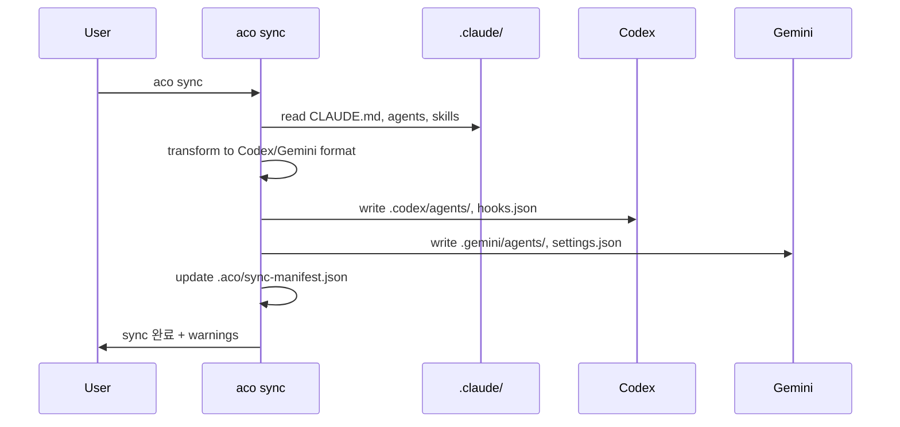

# Phase 2 계획 — 문서 품질 개선 (잔여)

**선행 조건:** Phase 1 (#62) 완료 후 진행

**목적:** Phase 1에서確立된 스타일을 기준으로, 사용자/운영자에게 필요한 나머지 문서를 정립

---

## 대상 파일

### 1. `docs/guides/runbook.md`

**현재 상태:**
- 배포 / 설치 / 일반적인 문제 3개 섹션
- 단순 텍스트 설명 + 코드 블록

**목표 스타일 (ccg-workflow-restore `configuration.md` 참조):**

| 요소 | 현재 | 목표 |
|------|------|------|
| 환경변수 테이블 | 없음 | ✅ 역할별 환경변수 정의 표 |
| 코드그룹 | 없음 | ✅ OS별 설치법 코드그룹 |
| 콜아웃 (::: details) | 없음 | ✅ 설정 예시折叠 |
| 디렉터리 구조 | 없음 | ✅ `~/.aco/` 구조 도식화 |

**구체적 개선:**

```markdown
## 환경변수

`~/.claude/settings.json`의 `"env"`에 설정:

| 변수 |干什么|기본값|언제 바꾸는지|
|------|------|------|------------|
| `ACO_SESSION_TIMEOUT` | 세션 타임아웃 | `7200` | 긴 작업 시 증가 |
| `ACO_PROVIDER_TIMEOUT` | Provider 호출 타임아웃 | `600` | 타임아웃 발생 시 |

::: details 전체 settings.json 예시

```json
{
  "env": {
    "ACO_SESSION_TIMEOUT": "7200"
  }
}
```

:::

## 디렉터리 구조

```
~/.aco/
├── sessions/
│   └── <uuid>/
│       ├── task.json   # 세션 메타데이터
│       └── output.log  # 대화 기록
└── sync-manifest.json  # 동기화 상태
```

## OS별 설치 (코드그룹)

::: code-group

```bash [macOS]
brew install @pureliture/ai-cli-orch-wrapper
```

```bash [Linux]
npm install -g @pureliture/ai-cli-orch-wrapper
```

```bash [npm]
npx @pureliture/ai-cli-orch-wrapper pack setup
```

:::

## 트러블슈팅 테이블

| 증상 | 원인 | 해결책 |
|------|------|--------|
| `aco: command not found` | PATH 미설정 | `npm install -g @pureliture/ai-cli-orch-wrapper` |
| Provider를 찾을 수 없음 | 인증 미실시 | `aco provider setup <name>` |
```

---

### 2. `docs/reference/context-sync.md`

**현재 상태:**
- 지원되는 CLI 표면 / Source 탐색 순서 / 손실 변환 경고
- 테이블 + 텍스트 설명

**목표 스타일:**

| 요소 | 현재 | 목표 |
|------|------|------|
| 필드 정의 테이블 | 있음 | ✅ 타입/기본값/설명 보강 |
| 시퀀스 다이어그램 | 없음 | ✅ `aco sync` 실행 흐름 Mermaid |
| 사용 예시 | CLI Usageのみ | ✅ 시나리오별 예시 추가 |
| 생성 파일 테이블 | 있음 | ✅ 관리 block과 raw file 구분 강화 |

**구체적 개선:**

```markdown
## aco sync 실행 흐름



## 필드 변환 표

| Claude Code 필드 | Codex 변환 | Gemini 변환 | 손실 여부 |
|-----------------|-----------|------------|----------|
| `reasoningEffort` | `model_reasoning_effort` (설정 전용) | **생략** | ⚠️ 손실 (runtime flag 없음) |
| `workspaceMode: read-only` | `sandbox_mode = "read-only"` | best-effort only | ⚠️ 부분 손실 |
| `hooks[].async: true` | 동기 변환 | 동기 변환 | ⚠️ 손실 (fire-and-forget 불가) |

## 시나리오별 사용법

### 새 시스템에서 처음 동기화

```bash
# 1. 설치
npx @pureliture/ai-cli-orch-wrapper pack setup

# 2. 동기화 확인
aco sync --check

# 3. 수동 동기화 (필요 시)
aco sync
```

### 동기화 충돌 감지

```bash
# 충돌 확인
aco sync --check
# 출력: ✗ stale: .codex/agents/custom.toml (manual edit detected)

# 강제 동기화 (수동 변경 덮어쓰기)
aco sync --force
```

### 드라이런 (변경 미리보기)

```bash
aco sync --dry-run
```
```

---

### 3. `docs/reference/project-board.md`

**현재 상태:**
- 설정 안내 / 필드 / View / ID / Branch Protection
- 설정 참조 위주

**목표 스타일:**

| 요소 | 현재 | 목표 |
|------|------|------|
| 실제 사용 시나리오 | 없음 | ✅ 이슈 → PR 흐름 시나리오 추가 |
| 필드 사용 맥락 | 최소 | ✅ 언제 어떤 필드를 쓰는지 설명 |
| 스크린샷/ GIF | 없음 (참조만) | ✅ UI 없이도 이해 가능한 설명 보강 |

**구체적 개선:**

```markdown
## 실제 사용 시나리오

### 시나리오: 새 기능 개발

```mermaid
flowchart LR
    A[Issue 생성] --> B[/gh-start #N]
    B --> C[Status: In Progress]
    C --> D[개발 진행]
    D --> E[/gh-pr]
    E --> F[PR 생성]
    F --> G[Status: In Review]
    G --> H[머지]
    H --> I[Status: Done]
```

### 이슈 작성 시 필드 설정

| 필드 | 설정 방법 | 주의사항 |
|------|----------|----------|
| Status | 자동으로 Backlog | 최초값 변경 금지 |
| Priority | P0/P1/P2에서 선택 | 긴급하지 않으면 P2 유지 |
| Size | S/M/L에서 선택 | 실제 예상 시간이 아닌 복잡도 기준 |
| Sprint | 해당 Iteration 선택 | 아직 설정되지 않으면 skip |
```

---

## 공통 스타일 가이드라인 (Phase 2 전체에 적용)

Phase 1에서確立된 스타일을 따름:

1. **Mermaid 우선** — ASCII 아트 대신 Mermaid 다이어그램 사용
2. **코드그룹 활용** — OS별/명령어별 예시는 코드그룹으로 구분
3. **테이블 활용** — 필드 정의, 환경변수, 트러블슈팅은 반드시 테이블로
4. **콜아웃 활용** — 설정 예시는 `::: details`折叠으로 처리
5. **시퀀스/플로우차트** — 실행 흐름은 Mermaid Sequence/Flowchart로

---

## 범위 (체크리스트)

- [ ] `docs/guides/runbook.md` — 환경변수 테이블, OS별 설치 코드그룹, 디렉터리 구조 도식화, 트러블슈팅 테이블
- [ ] `docs/reference/context-sync.md` — `aco sync` 시퀀스 다이어그램, 필드 변환 표, 시나리오별 사용법
- [ ] `docs/reference/project-board.md` — 이슈→PR 흐름 플로우차트, 필드 사용 맥락 설명
- [ ] Phase 3 잔여 명시 (VitePress 도입)

## 제외 범위

- CONTRIBUTING.md / 새 기여자 온보딩 가이드 (Phase 2에서 제외, Phase 3 또는 별도 이슈로)
- VitePress 도입 (Phase 3)
- Phase 1 파일 재작성

## 인수 기준

- [ ] `docs/reference/context-sync.md`에 Mermaid 시퀀스 다이어그램 1개 이상
- [ ] 3개 파일 모두에 코드그룹 또는 테이블 활용
- [ ] `docs/reference/project-board.md`에 이슈→PR 흐름 플로우차트
- [ ] Phase 3 잔여 명시
